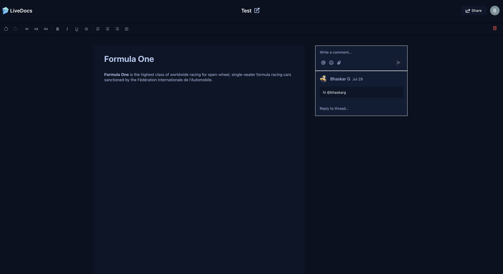
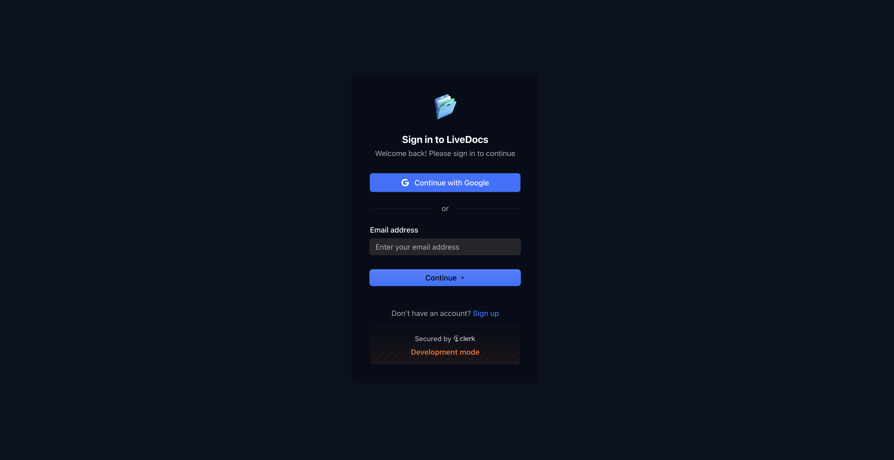

# LiveDocs - Real-Time Collaborative Document Editor

A modern, full-stack collaborative document editing platform built with Next.js, featuring real-time synchronization, rich text editing, and seamless collaboration capabilities. This project demonstrates expertise in building production-ready applications with modern web technologies.

## 🚀 Live Demo

**[👉 Try LiveDocs Now](https://live-docs.bhaskarg.workers.dev/)** - Experience real-time collaboration in action!


## 📸 Preview

### Document View
<table>
  <tr>
    <td width="50%" align="center">
      
      <br />
      <strong>Document Editor</strong>
    </td>
    <td width="50%" align="center">
      
      <br />
      <strong>Authentication</strong>
    </td>
  </tr>
</table>


## 🎯 Project Overview

LiveDocs is a Google Docs-inspired collaborative document editor that enables multiple users to edit documents simultaneously in real-time. The platform provides a seamless editing experience with features like live cursors, presence indicators, comments, and granular access control.

### Key Highlights

- **Real-Time Collaboration**: Multiple users can edit documents simultaneously with live synchronization
- **Rich Text Editing**: Built with Lexical editor framework, supporting formatting, headings, and more
- **Access Control**: Granular permissions system (Creator, Editor, Viewer roles)
- **Comments & Threading**: Inline commenting system with thread resolution
- **Cloudflare Deployment**: Optimized for edge computing with Cloudflare Workers
- **Modern Architecture**: Server components, client components, and server actions pattern

## ✨ Features

### Core Functionality
- ✅ **Real-Time Document Editing**: Live synchronization using Liveblocks
- ✅ **Rich Text Editor**: Built with Lexical framework
  - Text formatting (bold, italic, underline, strikethrough)
  - Headings (H1, H2, H3)
  - Text alignment (left, center, right, justify)
  - Undo/Redo functionality
- ✅ **User Presence**: See who's viewing/editing in real-time
- ✅ **Live Cursors**: Visual indicators showing where collaborators are editing
- ✅ **Comments System**: Inline comments with threading and resolution
- ✅ **Document Management**: Create, delete, and organize documents
- ✅ **Document Sharing**: Share documents with email-based access control
- ✅ **Role-Based Access**: Creator, Editor, and Viewer permissions

### User Experience
- ✅ **Authentication**: Secure authentication with Clerk
- ✅ **Responsive Design**: Mobile-first, responsive UI
- ✅ **Dark Theme**: Modern dark theme interface
- ✅ **Real-Time Notifications**: User activity notifications
- ✅ **Document Title Editing**: Inline document title editing
- ✅ **Active Collaborators Display**: See all active users on a document

## 🛠️ Tech Stack

### Frontend
- **Next.js 15.3.5** - React framework with App Router
- **React 19** - Latest React with server components
- **TypeScript 5** - Type-safe development
- **Tailwind CSS 4** - Utility-first CSS framework
- **Lexical** - Extensible text editor framework
- **Radix UI** - Accessible component primitives

### Backend & Real-Time
- **Liveblocks** - Real-time collaboration infrastructure
- **Next.js Server Actions** - Server-side data mutations
- **Clerk** - Authentication and user management

### Infrastructure & Deployment
- **Cloudflare Workers** - Edge computing deployment
- **OpenNext Cloudflare** - Next.js adapter for Cloudflare
- **Wrangler** - Cloudflare deployment tool

### Development Tools
- **ESLint** - Code linting
- **TypeScript** - Static type checking
- **Turbopack** - Fast bundler for development

## 🏗️ Architecture

### Project Structure
```
├── app/                    # Next.js App Router
│   ├── (auth)/            # Authentication routes
│   ├── (root)/            # Protected routes
│   │   ├── documents/     # Document pages
│   │   └── page.tsx       # Home/dashboard
│   ├── api/               # API routes
│   └── layout.tsx         # Root layout
├── components/             # React components
│   ├── editor/           # Lexical editor components
│   ├── ui/               # Reusable UI components
│   └── ...               # Feature components
├── lib/                   # Utilities and configurations
│   ├── actions/          # Server actions
│   └── liveblocks.ts     # Liveblocks configuration
└── types/                 # TypeScript type definitions
```

### Key Architectural Decisions

1. **Server Components**: Leverages Next.js 15 server components for optimal performance
2. **Server Actions**: Uses Next.js server actions for data mutations
3. **Real-Time Sync**: Liveblocks handles all real-time synchronization
4. **Edge Deployment**: Optimized for Cloudflare Workers edge computing
5. **Type Safety**: Full TypeScript coverage for maintainability

## 🚀 Getting Started

### Prerequisites
- Node.js 18+ or Bun
- npm, pnpm, or bun package manager
- Clerk account (for authentication)
- Liveblocks account (for real-time features)
- Cloudflare account (for deployment)

### Installation

1. **Clone the repository**
   ```bash
   git clone <repository-url>
   cd google-sheets-clone
   ```

2. **Install dependencies**
   ```bash
   npm install
   # or
   pnpm install
   # or
   bun install
   ```

3. **Set up environment variables**
   Create a `.env.local` file:
   ```env
   # Clerk Authentication
   NEXT_PUBLIC_CLERK_PUBLISHABLE_KEY=your_clerk_publishable_key
   CLERK_SECRET_KEY=your_clerk_secret_key
   NEXT_PUBLIC_CLERK_SIGN_IN_URL=/sign-in
   NEXT_PUBLIC_CLERK_SIGN_UP_URL=/sign-up

   # Liveblocks
   LIVEBLOCKS_SECRET_KEY=your_liveblocks_secret_key
   NEXT_PUBLIC_LIVEBLOCKS_PUBLIC_KEY=your_liveblocks_public_key

   # Sentry (Optional)
   DISABLE_SENTRY=true
   NEXT_PUBLIC_DISABLE_SENTRY=true
   ```

4. **Run the development server**
   ```bash
   npm run dev
   # or
   pnpm dev
   # or
   bun dev
   ```

5. **Open your browser**
   Navigate to [http://localhost:3000](http://localhost:3000)

## 📦 Deployment

### Cloudflare Workers Deployment

The project is configured for deployment on Cloudflare Workers using OpenNext Cloudflare adapter.

1. **Build for Cloudflare**
   ```bash
   npm run build:cloudflare
   ```

2. **Deploy**
   ```bash
   npm run deploy
   ```

3. **Preview**
   ```bash
   npm run preview
   ```

### Build Scripts
- `dev` - Start development server with Turbopack
- `build` - Build for production (standard Next.js)
- `build:cloudflare` - Build optimized for Cloudflare Workers
- `deploy` - Build and deploy to Cloudflare
- `preview` - Preview Cloudflare build locally

## 🎨 Key Features in Detail

### Real-Time Collaboration
- **Live Cursors**: See where other users are editing in real-time
- **Presence Indicators**: Visual representation of active users
- **Conflict Resolution**: Automatic conflict resolution for simultaneous edits
- **Sync Status**: Real-time synchronization status indicators

### Rich Text Editing
- **Formatting Tools**: Bold, italic, underline, strikethrough
- **Heading Support**: H1, H2, H3 heading levels
- **Text Alignment**: Left, center, right, and justify alignment
- **History**: Full undo/redo support
- **Floating Toolbar**: Context-aware formatting toolbar

### Access Control
- **Creator Role**: Full document control, can delete and manage access
- **Editor Role**: Can edit document content and share with others
- **Viewer Role**: Read-only access to documents
- **Email-Based Sharing**: Share documents via email addresses

### Comments System
- **Inline Comments**: Add comments to specific text selections
- **Threading**: Reply to comments in threads
- **Resolution**: Mark comments as resolved
- **Floating Composer**: Easy-to-use comment creation interface

## 🔒 Security Features

- **Authentication**: Secure authentication with Clerk
- **Route Protection**: Middleware-based route protection
- **Access Control**: Server-side access validation
- **Environment Variables**: Secure secret management
- **Type Safety**: TypeScript for compile-time error prevention

## 📊 Performance Optimizations

- **Server Components**: Reduced client-side JavaScript
- **Code Splitting**: Automatic code splitting with Next.js
- **Edge Deployment**: Cloudflare Workers for global edge deployment
- **Optimized Builds**: Cloudflare-specific build optimizations
- **Lazy Loading**: Component-level lazy loading
- **Image Optimization**: Next.js Image component optimization

## 🧪 Development Best Practices

- **TypeScript**: Full type safety across the codebase
- **ESLint**: Code quality and consistency
- **Component Architecture**: Reusable, composable components
- **Server Actions**: Type-safe server-side mutations
- **Error Handling**: Comprehensive error boundaries
- **Loading States**: Proper loading and suspense boundaries

## 📝 Code Quality

- **TypeScript**: 100% TypeScript coverage
- **ESLint**: Configured with Next.js recommended rules
- **Component Structure**: Modular, reusable component architecture
- **Type Definitions**: Comprehensive type definitions in `types/` directory
- **Server Actions**: Type-safe server-side operations

## 🌟 What Makes This Project Stand Out

1. **Production-Ready**: Built with production deployment in mind (Cloudflare Workers)
2. **Modern Stack**: Uses latest versions of Next.js, React, and TypeScript
3. **Real-Time Features**: Complex real-time collaboration implementation
4. **Scalable Architecture**: Designed for scalability with edge computing
5. **Type Safety**: Comprehensive TypeScript implementation
6. **Best Practices**: Follows Next.js and React best practices
7. **User Experience**: Polished UI with attention to detail
8. **Performance**: Optimized for speed and efficiency

## 🤝 Contributing

This is a portfolio project demonstrating full-stack development capabilities. For questions or feedback, please reach out.

## 📄 License

This project is for portfolio/demonstration purposes.

## 🔗 Related Technologies

- [Next.js Documentation](https://nextjs.org/docs)
- [Liveblocks Documentation](https://liveblocks.io/docs)
- [Lexical Documentation](https://lexical.dev/docs)
- [Clerk Documentation](https://clerk.com/docs)
- [Cloudflare Workers](https://developers.cloudflare.com/workers/)

---

**Built with ❤️ using Next.js, Liveblocks, and modern web technologies.**
**Thankyou for visting my repository**
**@Bhaskar Guthula**
